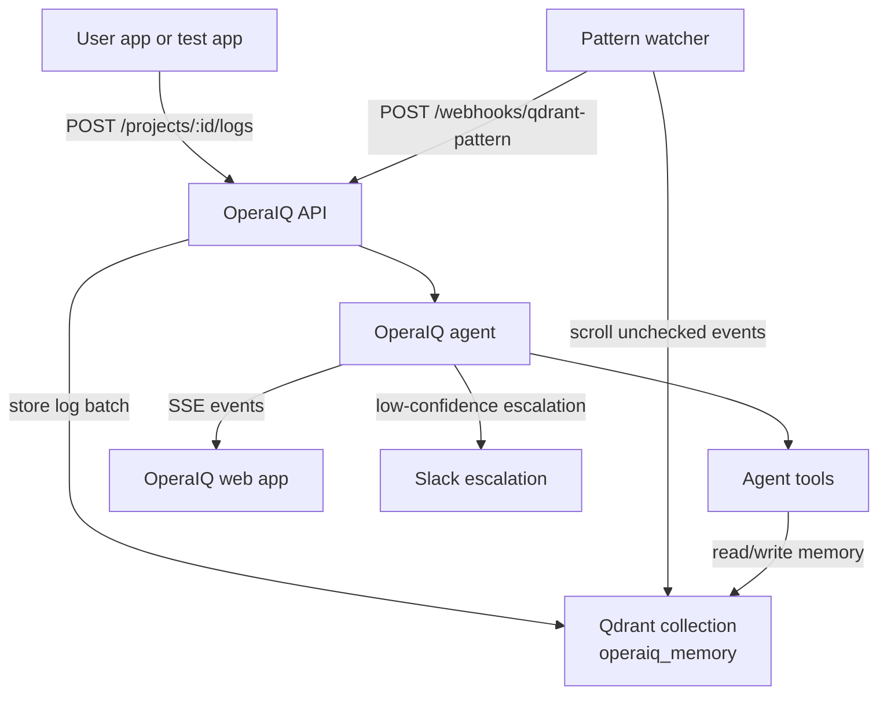

# OperaIQ Architecture

OperaIQ is an incident-response app with Qdrant as its operational memory. The API owns ingestion, pattern detection, webhook dispatch, agent execution, verification, and postmortem storage.

## Data flow

```text
application logs
-> POST /projects/:id/logs
-> Qdrant stores event payloads
-> OperaIQ pattern watcher scans unchecked events
-> POST /webhooks/qdrant-pattern
-> OperaIQ agent acts and verifies
-> Qdrant stores audit events and the postmortem
```

## Component diagram



## Components

| Component | Role |
| --- | --- |
| OperaIQ API | Stores logs, manages auth, runs the watcher, accepts pattern webhooks, exposes incident/brain endpoints |
| Qdrant | Stores events, incidents, runbooks, services, pattern alerts, audit entries, and postmortems |
| Pattern watcher | Groups unchecked log events by project, service, and fingerprint, then fires `/webhooks/qdrant-pattern` |
| OperaIQ agent | Runs ASSESS, REMEMBER, INVESTIGATE, MAP, RETRIEVE, ACT, VERIFY, CLOSE |
| Agent tools | Query Qdrant memory, fetch runbooks, map dependencies, execute remediation, write postmortems |
| Web app | Shows setup, test flow, incident state, brain stats, and Qdrant-backed proof |
| Slack | Optional escalation when confidence or verification is not enough for autonomous action |

## Reasoning loop

| Phase | What happens |
| --- | --- |
| ASSESS | Parse the OperaIQ alert payload |
| REMEMBER | Search Qdrant for similar resolved incidents |
| INVESTIGATE | Query Qdrant memory for current service signals |
| MAP | Read service dependencies and estimate blast radius |
| RETRIEVE | Select or create a runbook |
| ACT | Execute approved low-risk remediation |
| VERIFY | Confirm the failure signal dropped |
| CLOSE | Store the postmortem and update memory |

## Deployment

| Environment | Shape |
| --- | --- |
| Local | `docker-compose.qdrant.yml` for Qdrant, local API/web processes |
| AWS API | `deploy/aws/operaiq-compose.yml` runs `operaiq-api` and private `operaiq-qdrant` |
| Render web | `render.yaml` builds `apps/web/Dockerfile` and points to the AWS API |

See `README.md` for the quick test and proof flow.
