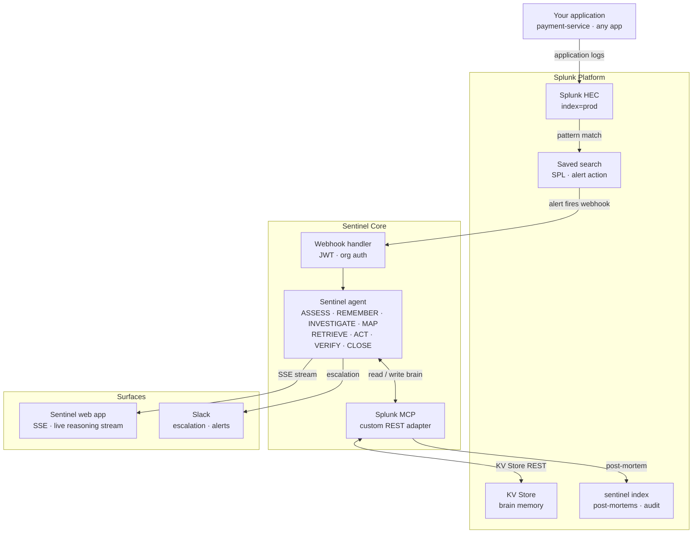

# Sentinel — Architecture

Autonomous incident response agent built on Splunk. This document shows the full data flow from application logs through Splunk detection to autonomous agent resolution.

## Data flow

Your application → Splunk HEC (`index=prod`)
→ Splunk saved search detects error pattern
→ Splunk fires alert action webhook to Sentinel
→ Sentinel agent: ASSESS → REMEMBER → INVESTIGATE → MAP → RETRIEVE → ACT → VERIFY → CLOSE
→ Post-mortem indexed back into Splunk
→ Brain updated — next incident resolved faster

## Component diagram

⚡️ AI Toolkit 5.7.4 — Splunk Hosted Models are capability-probed at startup. Active on Splunk Cloud Platform. Gemini fallback on local Enterprise.

## Component descriptions

| Component | Layer | Role |
| --- | --- | --- |
| Splunk HEC | Splunk | HTTP Event Collector — receives application log events into `index=prod` |
| Saved search | Splunk | Scheduled SPL query that detects error patterns, such as `ECONNRESET count > 15`, and fires an Alert Action webhook |
| KV Store | Splunk | Persistent brain memory — stores incidents, runbooks, services, audit log, and post-mortems per org |
| `sentinel` index | Splunk | Indexed post-mortems and audit events — makes the brain searchable via SPL and renders in the native dashboard |
| Webhook handler | Sentinel | Receives Splunk Alert Action payloads, validates per-org JWT and webhook secret, and passes to the agent |
| Sentinel agent | Sentinel | Runs the 8-phase reasoning loop using live Splunk data and KV Store memory |
| Splunk MCP | Sentinel | Custom REST adapter implementing the MCP tool interface against Splunk's management API, KV Store REST, and HEC |
| Sentinel web app | Surface | Next.js app streaming agent reasoning steps live via Server-Sent Events |
| Slack | Surface | Escalation path when agent confidence is below threshold or remediation attempts are exhausted |

## The 8-phase reasoning loop

Each incident streams through these phases in real time, visible in the Sentinel web app:

| Phase | What happens |
| --- | --- |
| ASSESS | Parse the Splunk alert payload — service name, symptom list, severity |
| REMEMBER | Search KV Store for similar past incidents and their proven resolutions |
| INVESTIGATE | Run targeted SPL queries against live log data in the current time window |
| MAP | Traverse the service dependency graph, identify blast radius, and upgrade severity if warranted |
| RETRIEVE | Select the best matching runbook from memory, or generate and save a new one |
| ACT | Execute low-risk remediations automatically; pause and page oncall for medium/high risk |
| VERIFY | Re-run the diagnostic SPL query to confirm the fix actually worked |
| CLOSE | Write a structured post-mortem to KV Store and index it into Splunk via HEC |

If three remediation attempts fail or match confidence is below threshold, Sentinel escalates to the oncall team via Slack with the full investigation context.

## Multi-tenancy

Every document in KV Store and every indexed event carries an `orgId`. All API reads filter by the `orgId` embedded in the request JWT. Cross-org data access returns `403`. Two organisations sharing a Sentinel deployment never see each other's incidents, runbooks, or post-mortems.

## Deployment

| Environment | Deployment |
| --- | --- |
| Local development | Docker Compose — Splunk Enterprise + API + Web |
| Production | Render / Google Cloud Run (`cloudbuild.sentinel.yaml`) |
| Splunk local | Splunk Enterprise via Cloudflare Tunnel |
| Splunk cloud | Splunk Cloud Platform (`SPLUNK_CLOUD_STACK_HOST`) |

See [SPLUNK_SETUP.md](./SPLUNK_SETUP.md) for full Splunk configuration and [deploy/render/README.md](./deploy/render/README.md) for production deployment.
